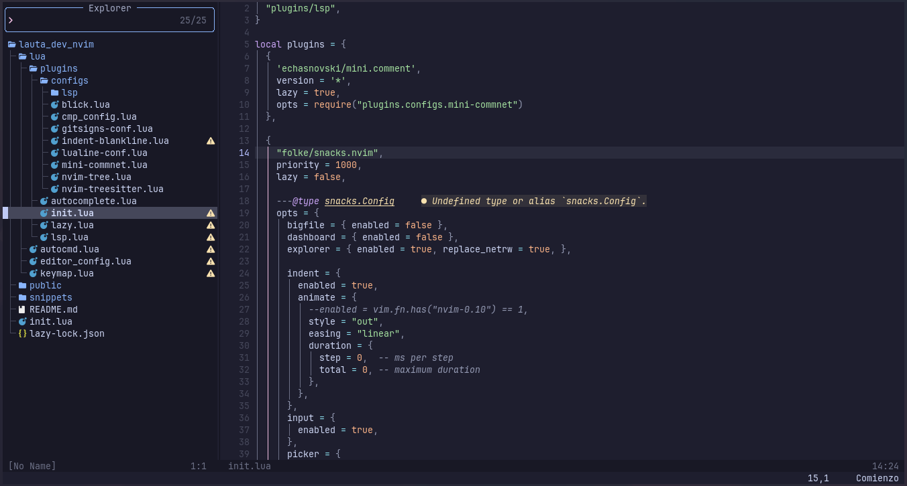

<h1 align="center">Configuración de nvim</h1>



Depencencias:
- git
- neovim >= 0.8.0

## Usar en local

1. Clonar el repositorio.
```sh
git clone https://github.com/Lauta-dev/nvim.git ~/.config/lauta_dev_nvim
```

2. Iniciar Neovim con el directorio de configuración
```bash
NVIM_APPNAME=lauta_dev_nvim nvim
```
> Esto evitara que elimine su configuración existente
